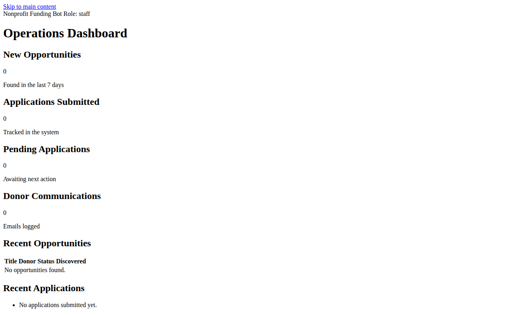

# Nonprofit Funding Bot

[](#)
[](#installation)
[](#license)

The Nonprofit Funding Bot helps staff discover funding opportunities, prevent duplicate applications, track submissions, manage donor outreach, generate application documents, and prepare daily operational summaries. It combines a Python core, a Flask web dashboard, and deployment paths for Docker today and Kubernetes as the scaling roadmap matures.

For planned milestones and release scope, see [roadmap.md](roadmap.md).

## Overview

The project is designed for nonprofit operations teams that need a lightweight workflow for:

- discovering grants, CSR opportunities, and NGO funding programs from trusted sources
- storing organizational profile data and credential references
- tracking applications in SQLite with duplicate protection
- logging outreach with opt-out safeguards and throttling
- generating PDF and DOCX-ready documents from templates
- emailing a daily summary report to staff
- expanding into dashboards, compliance tooling, and production deployment over time

## Architecture

| Component | Purpose |
| --- | --- |
| `funding_bot.py` | Core service and CLI entry point. Manages discovery, donor records, audit logs, document generation, outreach, status polling, and daily summaries. |
| `web/app.py` | Flask dashboard and JSON API for staff, admins, and auditors. Uses Basic Auth backed by role-specific environment variables. |
| SQLite database | Default operational store for opportunities, applications, donors, communications, documents, and audit logs. |
| `Dockerfile` / `docker-compose.yml` | Container packaging for the CLI and web dashboard, suitable for local and small-team deployments. |
| `k8s/` (roadmap target) | Planned Kubernetes manifests for horizontal scaling, CronJobs, secrets, and production orchestration in v0.5.0+. |

## Features by version

| Version | Status | Scope |
| --- | --- | --- |
| `v0.1.0` | ✅ Done | MVP: opportunity discovery, deduplication, SQLite tracking, document generation, outreach logging, daily summaries, and CLI-based scheduling. |
| `v0.2.0` | ✅ Done | Portal connectors, donor segmentation, GDPR-oriented compliance workflows, and engagement metrics. |
| `v0.3.0` | ✅ Done | Admin CLI extensions, credential vault integration, AI proposal drafting, and richer outreach analytics. |
| `v0.4.0` | ✅ Done | Web dashboard, role-based access, collaboration workflows, and monthly audit reports. |
| `v0.5.0` | ✅ Done | Docker and Kubernetes operations, retry/backoff resilience, and multi-language outreach templates. |
| `v1.0.0` | ✅ Done | Mature donor CRM behavior, full portal ecosystem, advanced compliance, and production release readiness. |

### Version details

#### v0.1.0 — MVP
- opportunity discovery from trusted sources
- duplicate prevention via stable signatures
- SQLite-backed application tracking
- PDF and DOCX document generation
- outreach logging with weekly throttling and opt-out protection
- daily summary email generation and SMTP delivery support

#### v0.2.0 — Multi-portal + engagement
- government, CSR, and NGO portal connectors
- donor segmentation (`corporate`, `institutional`, `individual`)
- GDPR-oriented auditability and encrypted credential handling
- personalized outreach templates with engagement metrics

#### v0.3.0 — Automation + intelligence
- admin CLI extensions: `list-opportunities`, `audit-log`, `list-donors`
- credential vault support for managed secrets
- AI-assisted proposal drafting from stored nonprofit profile data
- outreach analytics for opens, clicks, and donor response tracking

#### v0.4.0 — Dashboard + collaboration
- Flask web dashboard for operations visibility
- role-based access for admin, staff, and auditor personas
- monthly audit report generation
- collaboration workflows for shared review and follow-up
- self-service `/settings` panel for the organization profile, search keywords, and
  credential aliases, plus one-click actions to prove donation search and donor
  outreach without leaving the browser

#### v0.5.0 — Scaling + resilience
- Docker Compose deployment for local/shared hosting
- Kubernetes rollout for multi-instance operations
- retry/backoff handling for browser and portal failures
- multi-language outreach templates, including English and Bengali

#### v1.0.0 — Production release
- mature CRM-like donor and application history
- hardened compliance and accessibility processes
- automated daily, weekly, and monthly reporting
- onboarding-friendly staff documentation and production operations

## Installation

The core bot uses the Python standard library. Install Flask to use the web dashboard:

```bash
pip install flask
```

If you prefer the dashboard dependencies from the repository:

```bash
pip install -r web/requirements.txt
```

## Quick Start

### Run tests

```bash
python -m unittest discover -s tests
```

### Run the CLI

```bash
# Print the daily summary without sending it
python -m funding_bot send-daily-summary --dry-run

# Send the daily summary via SMTP
python -m funding_bot send-daily-summary --recipient lupael@i4e.com.bd

# List discovered opportunities (optionally filter by status)
python -m funding_bot list-opportunities
python -m funding_bot list-opportunities --status pending --limit 20

# View recent audit log entries
python -m funding_bot audit-log
python -m funding_bot audit-log --action application_recorded --limit 50

# List donors (optionally filter by segment)
python -m funding_bot list-donors
python -m funding_bot list-donors --segment corporate
```

### Run the web dashboard

```bash
python -m flask --app web.app run
```

## CLI Reference

Global option:

| Option | Description |
| --- | --- |
| `--db PATH` | Path to the SQLite database file. Default: `funding_bot.db`. |

Command reference:

| Command | Version | Key options | Purpose | Status |
| --- | --- | --- | --- | --- |
| `send-daily-summary` | `v0.1.0` | `--recipient EMAIL`, `--dry-run` | Build the daily funding report and either print it or send it through SMTP. | Available |
| `list-opportunities` | `v0.3.0` | `--status STATUS` | List discovered opportunities, optionally filtered by status. | Available |
| `audit-log` | `v0.3.0` | `--limit N`, `--action ACTION` | Review recent audit events for compliance and operational troubleshooting. | Available |
| `list-donors` | `v0.3.0` | `--segment {corporate,institutional,individual,unknown}` | List donor records and segment membership. | Available |
| `monthly-audit-report` | `v1.0.0` | `--year YEAR`, `--month MONTH`, `--output FILE` | Generate a monthly GDPR/ISO compliance audit report as JSON. | Available |
| `discover` | `v0.3.0` | `--keywords KEYWORDS`, `--trusted-sources SOURCES` | Query every configured portal connector and persist new opportunities (proves donation search). | Available |
| `send-outreach` | `v0.3.0` | `--email EMAIL`, `--name NAME`, `--subject TEMPLATE`, `--body TEMPLATE`, `--dry-run` | Compose and send (or preview) a personalized donor outreach email (proves donor communication). | Available |
| `set-organization-profile` | `v0.4.0` | `--file FILE` | Store the nonprofit's organization profile from a JSON file (or stdin). | Available |
| `register-credential` | `v0.4.0` | `--alias ALIAS`, `--env-var ENV_VAR` | Register a credential alias that resolves to an environment variable. | Available |
| `show-settings` | `v0.4.0` | *(none)* | Print the organization profile, search settings, and credential aliases. | Available |

## SMTP Configuration

Set the following environment variables before running the `send-daily-summary`
command (or before calling `SMTPEmailSender.from_env()` programmatically):

| Variable        | Default       | Description                                |
|-----------------|---------------|--------------------------------------------|
| `SMTP_HOST`     | `localhost`   | Mail server hostname                       |
| `SMTP_PORT`     | `587`         | Mail server port                           |
| `SMTP_USERNAME` | *(empty)*     | Login username                             |
| `SMTP_PASSWORD` | *(empty)*     | Login password                             |
| `SMTP_USE_TLS`  | `1`           | Set to `0` to disable STARTTLS             |
| `SMTP_FROM`     | username      | Envelope `From` address                    |

## Web Dashboard

The dashboard is intended for v0.4.0+ operations and is already scaffolded in `web/app.py`.

### Run locally

```bash
pip install flask
python -m flask --app web.app run
```

### Dashboard screenshot



### Role-based authentication

The dashboard uses HTTP Basic Auth. Use one of these usernames as the role name:

| Username | Environment variable | Access |
| --- | --- | --- |
| `admin` | `ADMIN_PASSWORD` | Full control, including submissions and donor updates |
| `staff` | `STAFF_PASSWORD` | Operational read access to dashboard and opportunity views |
| `auditor` | `AUDITOR_PASSWORD` | Read access to dashboard, donors, analytics, and audit logs |

### Available routes

| Route | Method | Roles | Purpose |
| --- | --- | --- | --- |
| `/` | `GET` | Public | Redirect to `/dashboard`. |
| `/dashboard` | `GET` | `staff`, `admin`, `auditor` | HTML operations dashboard (WCAG 2.1 accessible). |
| `/opportunities` | `GET` | `staff`, `admin`, `auditor` | List opportunities as JSON. |
| `/opportunities/<signature>` | `GET` | `staff`, `admin`, `auditor` | Show one opportunity, linked application, and submission attempts. |
| `/opportunities/<signature>/submit` | `POST` | `admin` | Record a submission result for an opportunity. |
| `/donors` | `GET` / `POST` | `admin`, `auditor` for `GET`; `admin` for `POST` | List or upsert donor records. |
| `/donors/<email>/opt-out` | `POST` | `admin` | Mark a donor as opted out. |
| `/analytics` | `GET` | `admin`, `auditor` | Return outreach analytics data. |
| `/audit-log` | `GET` | `admin`, `auditor` | Return the latest audit log entries. |
| `/settings` | `GET` | `staff`, `admin`, `auditor` | Self-service settings panel: organization profile, search keywords, credential aliases, and proof-of-capability actions. |
| `/settings/organization` | `POST` | `admin` | Update the organization profile. |
| `/settings/search` | `POST` | `admin` | Update donation-search keyword filters and trusted sources. |
| `/settings/credentials` | `POST` | `admin` | Register a credential alias (never exposes secret values). |
| `/settings/discover` | `POST` | `admin` | Run every portal connector now and persist new opportunities — proves the bot can search for funding. |
| `/settings/test-outreach` | `POST` | `admin` | Compose (dry-run) or send a donor outreach email — proves the bot can communicate with donors. |
| `/feedback` | `POST` | `staff`, `admin` | Submit partner feature-request or bug-report feedback. |
| `/metrics` | `GET` | `admin`, `auditor` | Prometheus-compatible text metrics for Grafana scraping. |
| `/health` | `GET` | Public | Health-check endpoint. |

### Prometheus metrics

The `/metrics` endpoint exposes the following gauges and counters in the Prometheus text exposition format:

| Metric | Type | Description |
| --- | --- | --- |
| `funding_bot_opportunities_total` | counter | Total opportunities discovered |
| `funding_bot_applications_total` | counter | Total grant applications recorded |
| `funding_bot_pending_applications` | gauge | Applications awaiting a decision |
| `funding_bot_donors_total` | gauge | Total donor records |
| `funding_bot_opted_out_donors` | gauge | Donors who have opted out |
| `funding_bot_audit_log_entries_total` | counter | Total audit log entries |
| `funding_bot_communications_total` | counter | Total outreach emails logged |
| `funding_bot_uptime_seconds` | gauge | Seconds since the web process started |

Add a scrape target pointing to `http://<host>:5000/metrics` in your Prometheus configuration or Grafana Agent config, and authenticate with an `admin` or `auditor` dashboard role.

### Partner feedback

Staff and admin users can submit feedback for the feature backlog:

```bash
curl -u staff:$STAFF_PASSWORD \
  -X POST http://localhost:5000/feedback \
  -H "Content-Type: application/json" \
  -d '{"category": "feature_request", "message": "Add CSV export for audit logs.", "contact": "partner@ngo.org"}'
```

Allowed categories: `feature_request`, `bug_report`, `general`.
The `message` field must be non-empty and at most 2000 characters.

## Proof: Search and Donor Communication

Two independent ways to demonstrate the bot searching for donation opportunities and
communicating with a donor — from the CLI or from the `/settings` admin panel, without
touching code or environment variables.

### From the CLI

```bash
# Search every configured portal connector and store any new opportunities.
python funding_bot.py discover --keywords "education,csr"

# Compose (and, unless --dry-run, send via SMTP) a personalized donor email.
python funding_bot.py send-outreach --email donor@example.org --name "Jane Donor" --dry-run
```

### From the web Settings panel

1. Sign in to `/settings` as `admin`.
2. Click **Run discovery now** under "Prove: Donation Search" to query every portal
   connector and see newly discovered opportunities rendered as JSON.
3. Fill in a donor email/name under "Prove: Donor Communication" and click
   **Send test outreach**. With "Dry run" checked, the email is composed and logged
   without being delivered; uncheck it (with SMTP credentials configured) to deliver
   a real message.

Both actions are logged to the audit trail (`audit-log` / `/audit-log`) for
compliance review.

## Docker Deployment

The repository includes a `Dockerfile` and `docker-compose.yml`.

1. Copy environment settings:

   ```bash
   cp .env.example .env
   ```

2. Update values in `.env` for SMTP credentials, database path, and dashboard passwords.
3. Start the stack:

   ```bash
   docker compose up
   ```

The Compose stack runs:
- a CLI container for bot jobs
- a Flask web container on `http://localhost:5000`
- a shared volume for SQLite data at `/app/data`

## Kubernetes Deployment

Kubernetes is the v0.5.0+ deployment target.

```bash
kubectl apply -f k8s/
```

Recommended secret/config inputs:

- SMTP settings: `SMTP_HOST`, `SMTP_PORT`, `SMTP_USERNAME`, `SMTP_PASSWORD`, `SMTP_USE_TLS`, `SMTP_FROM`
- dashboard auth: `ADMIN_PASSWORD`, `STAFF_PASSWORD`, `AUDITOR_PASSWORD`
- persistence/runtime: `BOT_DB_PATH`

Use a `CronJob` for scheduled summary delivery and a `Deployment`/`Service` pair for the dashboard. If the `k8s/` manifests are not yet present in your branch, treat this as the target structure for the scaling release.

## GDPR / Compliance

Compliance is a cross-version concern:

- audit activity is stored in the `audit_logs` table
- donor opt-out state is enforced during outreach
- donor segmentation supports controlled communications
- roadmap compliance helpers should expose `gdpr_export()` and `gdpr_delete()` workflows for subject-access and erasure requests

In practice, `gdpr_export()` should bundle all donor/application data tied to a subject, while `gdpr_delete()` should remove or anonymize personal data while preserving required audit history.

## Scheduling

Use a system cron job to send the report every day at 9 AM:

```cron
0 9 * * * cd /path/to/funding-bot && python -m funding_bot send-daily-summary
```

For Kubernetes deployments, mirror this schedule with a `CronJob` that runs the same CLI command inside the bot container.

## Partner Onboarding

Use the included onboarding script to set up a new NGO partner environment in a single step:

```bash
bash scripts/onboard.sh
```

The script:
1. Verifies Python 3.11+ and Docker prerequisites.
2. Copies `.env.example` to `.env` and prompts for SMTP credentials and dashboard passwords (passwords are not echoed).
3. Installs Python dependencies.
4. Runs the test suite.
5. Builds and starts the Docker Compose stack (pass `--skip-docker` to skip).
6. Smoke-tests the `/health` endpoint.

Options:

| Option | Description |
| --- | --- |
| `--env-file PATH` | Path to write the `.env` file (default: `.env`). When Docker is enabled, the script links `.env` to this file so Compose uses the same values. |
| `--db-path PATH` | SQLite database path written into `.env` (default: `/app/data/funding_bot.db`). |
| `--skip-docker` | Set up the Python environment only; do not start Docker. |

## Compliance Reports

Generate a monthly audit report for any period:

```bash
# Print to stdout (JSON)
python -m funding_bot monthly-audit-report

# Save to a file for a specific month
python -m funding_bot monthly-audit-report --year 2025 --month 6 --output reports/2025-06-audit.json
```

The report includes:
- Audit log entries grouped by action type
- GDPR operations (exports, deletions, opt-outs)
- Application outcome counts by status
- Outreach analytics (sent, opened, clicked, bounce rate)
- New donor registrations and total opted-out count

## Roadmap

Release planning lives in [roadmap.md](roadmap.md). Use it alongside this README when onboarding new staff, planning environment changes, or sequencing upcoming feature work.

## License

No project license is published in this repository yet. Update this section and the badge above when a license is chosen.
